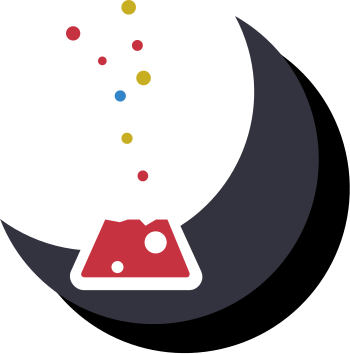

    

    

Soy programador/desarrolador, titulado en la carrera Analista Programador, apasionado a la programación, principalmente relacionado al desarrollo de aplicaciones u paginas WEB, autodidacta y con dedicación a produndizar o mejorar lo que aprendo, mi principal stack es JavaScript y su ecosistema.

    

> [!NOTE]
> Si no se puede acceder a mi portafolio, se puede acceder desde [*aquí*](https://mathiussolis.vercel.app/).

 

 
 
<ul>
    <li>
    📖 
        
        
        
        
        
        
    </li>
    <li>
    🚀 
        
        
        
        
        
        
        
        
    </li>
    <li>
        🛠️ 
        
        
    </li>
</ul>
